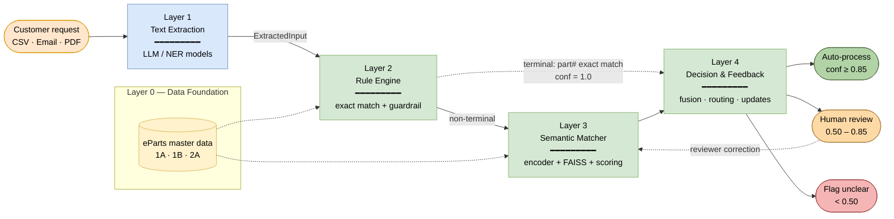
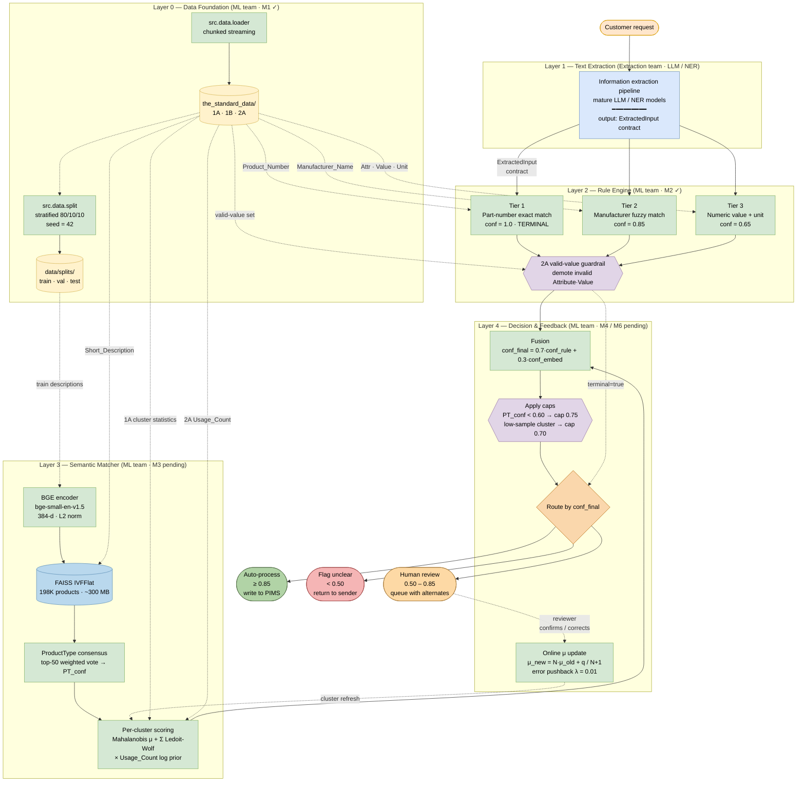

# V1 Architecture Diagram — eParts ML Pipeline

This document provides three artifacts:

1. **§1** — A compact executive-view Mermaid diagram (use this in
   client / status-update slides).
2. **§2** — A detailed Mermaid diagram showing per-layer internals
   (use this with teammates / for technical reviews).
3. **§3** — A structured natural-language description of the diagram,
   suitable as a prompt for ChatGPT, Claude, or any diagram-generation
   tool that does not consume Mermaid directly.

> All three artifacts encode the same architecture — they differ only in
> level of detail and presentation format.

---

## 1. Executive view (Mermaid, ~10 nodes)

This is the version to show clients or non-technical stakeholders.
GitHub, GitLab, Notion, VS Code, and most modern doc tools render this
block natively.



**Reading guide:**

* **Blue** = work owned by the extraction sub-team.
* **Green** = work owned by the ML team.
* **Yellow** = static reference data provided by eParts.
* **Solid arrow** = primary data flow.
* **Dotted arrow** = secondary or feedback data flow (data lookups,
  online corrections, terminal short-circuit).
* The terminal short-circuit (`L2 → L4` dotted line) is the
  fast-path for customer requests that cite an exact eParts part
  number — these never need the semantic matcher.

---

## 2. Detailed view (Mermaid, ~25 nodes)

This version exposes each layer's internal components. Use when
walking teammates through the pipeline implementation.



**Reading guide (in addition to §1):**

* Diamond / hexagon nodes (`{{...}}`) are checks or guards, not
  transformations.
* The orange diamond at the bottom of L4 is the routing decision.
* Edges into the FAISS / cluster boxes from `RAW` and `SPLITS` are
  **build-time** dependencies (training the index and computing
  cluster statistics), not query-time lookups.
* The feedback arrow from `UPDATE` back to `SCORE` represents the
  online μ-update behavior (spec §4.4) — cluster centroids drift
  with each reviewer confirmation; no retraining required.

---

## 3. Prompt — generate the diagram in any tool

If you want to regenerate this in PowerPoint, Lucidchart, Excalidraw,
draw.io, or via ChatGPT / Claude / image-generation tools, paste the
prompt below.

````text
Generate a layered architecture diagram for the "eParts ML Confidence
Scoring System (V1)". The diagram has five layers stacked top to bottom,
plus a feedback loop. Use color to indicate team ownership.

OWNERSHIP COLORS
- Yellow:  static reference data provided by eParts
- Blue:    Layer 1, owned by the Extraction sub-team (LLM / NER models)
- Green:   Layers 0, 2, 3, 4, owned by the ML team

NODES (top to bottom)

1) Customer request — a CSV row, an email, or a PDF spec sheet. (input)

2) Layer 0 — Data Foundation. ML team. Two components feeding into a
   data store:
     - "Raw data: 1A Product Attribute Pairs, 1B Product Master, 2A
       Values per Attribute" (yellow cylinder)
     - "Chunked data loader (streams 1A in 200k-row chunks)" (green box)
     - "Stratified split (80/10/10 by ProductType, seed=42)" (green box)
     - "Splits store: train/val/test parquet" (yellow cylinder)

3) Layer 1 — Text Extraction. Extraction sub-team. Single component:
     - "Information extraction pipeline (mature LLM / NER models).
       Output conforms to the ExtractedInput contract" (blue box)

4) Layer 2 — Rule Engine. ML team. Four components in parallel:
     - Tier 1: "Part-number exact match. Confidence = 1.0. TERMINAL."
     - Tier 2: "Manufacturer fuzzy match (rapidfuzz, threshold 90).
       Confidence = 0.85."
     - Tier 3: "Numeric value + unit match against 2A. Confidence = 0.65."
     - "2A valid-value guardrail" (hexagonal check shape; demotes any
       (Attribute, Value) pair not present in 2A)
   All three tiers flow into the guardrail.

5) Layer 3 — Semantic Matcher. ML team. Four components in series:
     - "BGE encoder (bge-small-en-v1.5, 384-dimensional, L2-normalized)"
     - "FAISS IVFFlat index over 198,148 products (~300 MB)"
       (cylinder shape)
     - "ProductType consensus via top-50 weighted vote → PT_conf"
     - "Per-cluster Mahalanobis scoring with Ledoit-Wolf covariance,
       weighted by 2A Usage_Count log prior"

6) Layer 4 — Decision & Feedback. ML team. Four components:
     - "Fusion: conf_final = 0.7·conf_rule + 0.3·conf_embed"
     - "Caps: PT_conf<0.60 → 0.75; low-sample cluster → 0.70"
       (hexagonal check)
     - "Route by conf_final" (diamond decision node)
     - "Online μ update: μ_new = (N·μ_old + q)/(N+1); error pushback
       λ=0.01" (used by feedback loop)

7) Three terminal outcomes from the routing decision:
     - Auto-process (green pill): conf ≥ 0.85, write to PIMS
     - Human review (orange pill): 0.50 ≤ conf < 0.85, queue with
       alternates
     - Flag unclear (red pill): conf < 0.50, return to sender

EDGES (data flow)

- Customer request → Layer 1
- Layer 1 → Layer 2 Tier 1 / Tier 2 / Tier 3 (labeled "ExtractedInput
  contract")
- Layer 2 guardrail → Layer 4 fusion (NORMAL PATH)
- Layer 2 guardrail → Layer 4 routing, dotted, labeled
  "terminal=true (skip Layer 3)" — this is the part-number exact-match
  fast-path
- Layer 3 scoring → Layer 4 fusion
- Layer 4 routing → Auto-process / Human review / Flag unclear

EDGES (data dependencies, dashed)

- Raw data → Tier 1 (Product_Number column)
- Raw data → Tier 2 (Manufacturer_Name column)
- Raw data → Tier 3 (2A Attribute/Value/Unit triples)
- Raw data → guardrail (2A valid-value set)
- Raw data → FAISS (1B Short_Description for indexing)
- Splits store → BGE encoder (train descriptions)
- Raw data → cluster scoring (1A for cluster μ and Σ)
- Raw data → cluster scoring (2A Usage_Count for the prior)

EDGES (feedback loop, dotted)

- Human review → reviewer → Online μ update
- Online μ update → cluster scoring in Layer 3 (refresh centroids)

ANNOTATIONS

- Mark Layer 1 with "Extraction team scope; output is the
  ExtractedInput dataclass defined in src/contracts.py"
- Mark Layer 2 with "M2 done"
- Mark Layer 3 with "M3 pending — encoder + FAISS already installed"
- Mark Layer 4 with "M4 / M6 pending"
- Show that the terminal short-circuit at Tier 1 means Layer 3 can be
  skipped entirely for customers who already supply a known part number

The diagram should fit comfortably on one slide. Prefer landscape
orientation. Use short labels; put the math formulas in node subtitles,
not on the edges.
````

---

> **Vocabulary note: V1 performs no neural-network training.** The BGE
> encoder is pre-trained and frozen (spec §4.3 [3a]). What looks like
> "training" in conversation is really four discrete things — **encoding**
> descriptions into vectors, **indexing** them for similarity search,
> **computing** per-cluster mean + covariance from 1A as classical
> statistics, and **calibrating** σ by grid search on validation. No
> gradient descent, no epochs, no learning rates. Real model training
> (encoder fine-tuning) is V2 backlog (spec §9.2). Use "encode" / "index"
> / "calibrate" rather than "train" when describing V1 to clients.

## 4. Notes for presenting

When walking through the diagram, the most useful points to call out
in this order:

1. **The pipeline is four layers, not one model.** Confidence comes
   from combining deterministic rule signals (Layer 2) with semantic
   similarity signals (Layer 3) and applying calibrated thresholds
   (Layer 4). This is what makes the output explainable and auditable.
2. **Two teams collaborate at the Layer 1 / Layer 2 boundary.** The
   `ExtractedInput` dataclass is the formal contract — see
   [ExtractionHandoff_Spec.md](ExtractionHandoff_Spec.md). Either side
   can swap implementations without breaking the other.
3. **The terminal short-circuit at Tier 1** is the system's
   common-case fast path. A customer who cites a known eParts part
   number gets a confidence-1.0 auto-process result in milliseconds —
   no ML scoring required.
4. **The semantic matcher is hierarchical**, not a flat similarity
   search. The ProductType consensus step (top-50 vote) narrows the
   ~487-attribute space down to ~4 attributes per query, which is why
   the system stays fast on CPU.
5. **The system learns from reviewer feedback online** without
   retraining. Each correction nudges the relevant cluster centroid;
   the FAISS index and encoder are untouched. This keeps deployment
   simple and avoids retraining cadences.
6. **Frozen vs tunable.** Confidence math (Mahalanobis, the α=0.7
   fusion, the 0.85/0.50 thresholds) is part of the client-facing
   commitment per spec §6.1 and cannot change without a design review.
   Encoder choice, FAISS parameters, and consensus thresholds are
   tunable (§6.2) and can be optimized post-launch.
