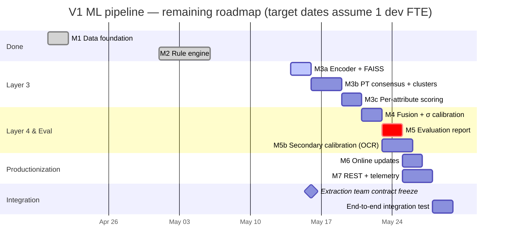

# V1 Development Plan — eParts ML Pipeline Completion

**Owner:** ML team — eParts Capstone (MSE Studio).
**Date:** 2026-05-13.
**Status:** Active plan. Reviewed at each milestone close.
**Related docs:**
[V1 Engineering Spec](V1_Architecture_Design.md) ·
[Architecture diagram](Architecture_Diagram.md) ·
[Data Utilization Report](Data_Utilization_Report.md) ·
[Extraction Handoff Spec](ExtractionHandoff_Spec.md).

---

## 1. Where we are

| Layer | Milestone | Owner | Status |
|---|---|---|---|
| Layer 0 — Data foundation | M1 (loaders, splits) | ML team | ✅ Done |
| Layer 1 — Text extraction | (out of ML scope) | Extraction team | 🔄 Their team's plan |
| Layer 2 — Rule engine | M2 | ML team | ✅ Done (56/56 tests green) |
| Layer 3 — Semantic matcher | M3a / M3b / M3c | ML team | ⏳ **Up next** |
| Layer 4 — Decision & feedback | M4 + M6 | ML team | ⏳ Pending |
| Evaluation | M5 | ML team | ⏳ Pending |
| Service | M7 | ML team | ⏳ Pending |

The ML team is **~30 % of the way through V1** by milestone count (2 of 7
done) and **~25 % by budgeted effort** (5 days of an estimated ~21 days
of total Layer 0–4 work; the Layer 1 portion of M2 transferred to the
extraction team).

## 2. Where we're going — the roadmap at a glance



**Bottom-line numbers:**

| Metric | Value |
|---|---|
| Milestones remaining | **5** (M3, M4, M5, M6, M7) |
| Estimated dev days remaining | **~15 days** (1 FTE) |
| Critical path length | **~12 days** (M3a → M3b → M3c → M4 → M5) |
| Buffer / parallelism gain | M5b (secondary calibration) and M6/M7 parallelize ~3 days off the critical path |

---

## 3. Milestone-by-milestone plan

Each milestone below states **goal**, **work items**, **acceptance
criteria**, **dependencies**, and **risks specific to that step**.
Parameter-level technical detail lives in the V1 Engineering Spec —
this document is the *roadmap*, not the spec.

### 3.1 M3a — Encoder + FAISS index

**Goal.** Build a 384-dimensional sentence-transformer encoder
wrapper and a FAISS IVFFlat index over all 198,148 product
descriptions in 1B. After M3a a query string can be turned into the
top-50 most-similar products in single-digit milliseconds.

**Work items.**
1. Wrap `sentence-transformers/BAAI/bge-small-en-v1.5` in
   `src/layer3_semantic/encoder.py` (config-driven, frozen weights).
2. Encode 1B's `Short_Description` + `Extended_Description_Pre`
   (concatenated) in batches.
3. Build a FAISS IVFFlat index (`nlist=512`, trained on a 100K
   random subset, seed=42). Persist to
   `artifacts/v1/run_<ts>/faiss.bin`.
4. Implement `Layer3SemanticMatcher.search(query, k=50)`.
5. Write `scripts/m3a_build_index.py` (build) and
   `scripts/m3a_retrieval_demo.py` (smoke test).

**Acceptance criteria (spec §7.2 M3a).**
* End-to-end retrieval demo: query → top-50 with similarity scores.
* Latency ≤ 10 ms on CPU for a batch of 1.
* `index.ntotal == 198147`, reloaded successfully from disk.

**Dependencies.** None — all libraries are installed, 1B is on disk.

**Risks.** Encoder download from Hugging Face Hub is one-time
(~130 MB) and could be slow on first build. FAISS index build memory
peaks at ~600 MB during training; fine on the dev machine, worth
verifying in CI.

**Effort.** ~2 days.

---

### 3.2 M3b — ProductType consensus + cluster persistence

**Goal.** Use the FAISS index to compute the spec's hierarchical
routing signal: top-K vote on ProductType → `PT_conf`. Also build the
`(ProductType, Attribute, Value)` cluster statistics from 1A that
Layer 3's scoring math needs.

**Work items.**
1. Implement weighted ProductType voting from top-50 FAISS neighbors;
   compute `PT_conf` per spec §4.3 [3c].
2. For each `(ProductType, Attribute, Value)` triple in the 1A *train
   split*, compute mean embedding `μ` and Ledoit-Wolf shrinkage
   covariance `Σ`. Stream 1A in 200K-row chunks to stay in budget.
3. Flag clusters with `N < 5` as low-sample (will be conf-capped at
   inference time).
4. Persist cluster metadata to
   `artifacts/v1/run_<ts>/centroids.parquet`.
5. Tests: ≥ 95 % training-set ProductType accuracy; ~20–30 low-sample
   clusters (empirical sanity check); every Σ is positive-definite.

**Acceptance criteria.** Spec §7.2 M3b items 1–3 all pass.

**Dependencies.** M3a (needs the encoder + FAISS index).

**Risks.** Cluster building over 1A is the most computationally
expensive step in V1 (we will encode ~1 M+ description rows). Plan
for ~2–4 hours of one-time wall time; consider running overnight or
on a higher-memory machine. Disk I/O on 1A is the bottleneck, not CPU.

**Effort.** ~3 days (includes the cluster build run-time).

---

### 3.3 M3c — Per-attribute per-value scoring

**Goal.** Given a query and its predicted ProductType, score each
relevant attribute against each candidate value using the
Mahalanobis-based confidence formula. Return top-3 values per
attribute.

**Work items.**
1. For each attribute in `ProductTypeAttributes[PT_predicted]` (~4
   per query), compute `D² = (q - μ)ᵀ Σ⁻¹ (q - μ)`.
2. Apply the Gaussian decay `conf_embed = exp(-D² / 2σ²)` (σ is per-PT,
   calibrated in M4 — placeholder of σ=1.0 until then).
3. Apply the Usage_Count log prior from 2A.
4. Return top-3 values per attribute as `SemanticHit` objects.
5. Property tests: scores in `[0, 1]`,
   `conf_embed_final ≤ usage_prior`, low-sample clusters flagged.

**Acceptance criteria.** Spec §7.2 M3c items 1–3.

**Dependencies.** M3b (needs cluster statistics).

**Risks.** Edge cases around clusters with `N` close to embedding
dimension (384). Ledoit-Wolf handles this by shrinking toward identity;
no extra mitigation needed but worth a sanity check.

**Effort.** ~2 days.

---

### 3.4 M4 — Fusion + σ calibration

**Goal.** Implement Layer 4's decision logic: fuse rule and semantic
confidences, apply caps, route by threshold, and calibrate σ per
ProductType on the validation split.

**Work items.**
1. Implement `Layer4Decision.fuse(...)` per spec §4.4:
   * `conf_final = 0.7 · conf_rule + 0.3 · conf_embed_final`
   * Apply caps: `PT_conf < 0.60 → 0.75`, low-sample cluster → 0.70
   * Route to auto / review / unclear per thresholds.
2. Implement σ grid-search per ProductType on the val split:
   minimize `Brier + 0.5 · ECE` over `σ ∈ {0.1, 0.3, 0.5, 1.0, 2.0, 5.0}`.
3. Persist σ table to `artifacts/v1/run_<ts>/sigma_table.parquet`.
4. Property tests (spec §7.2 M4): `conf_final ∈ [0, 1]`,
   `conf_final = 1.0 ↔ Tier-1 exact match`, ambiguity cap enforced.

**Acceptance criteria.** Spec §7.2 M4 items 1–3.

**Dependencies.** M3c.

**Risks.** σ calibration on curated 1A text will be **optimistic** —
this is the known §2.3 caveat. M4 does the *first* calibration pass;
M5b will refine it on OCR'd PDF text.

**Effort.** ~2 days.

---

### 3.5 M5 — Evaluation report + M5b secondary calibration

**Goal.** Produce the V1 evaluation report against the test split,
plus the spec-required secondary calibration pass on OCR'd PDF text
to mitigate the σ-optimism caveat.

**M5 work items.**
1. Run inference over the test split (~20K products) with the
   M3+M4 pipeline.
2. Compute every metric in spec §5.4 / §7.2 M5:
   top-1 / top-3 accuracy, ProductType accuracy, ECE,
   auto-process precision and coverage at `≥ 0.85`, p50 / p95
   latency.
3. Generate the required visual artifacts (spec §5.5):
   per-ProductType reliability diagrams, top-10 attribute confusion
   matrix, top-N failure cases CSV, latency histogram, confidence
   distribution histogram.
4. Commit the bundle to `reports/v1/<timestamp>/`.

**M5b — Secondary calibration (parallel to M5, ~3 days).**
1. Sample ~500 entries from `1A_Product_Document_Links` (image=0 →
   text-bearing PDFs).
2. OCR the sampled PDFs into a calibration corpus
   (`data/ocr_cache/`).
3. Re-run the σ grid-search on the OCR'd corpus → produce a *second*
   σ table.
4. Compare the two σ tables side-by-side in the M5 report and adopt
   the OCR-calibrated values for production.

**Acceptance criteria.** Spec §7.2 M5: every target hit, or
explicitly flagged as missed with a root cause. Top-20 failure cases
manually reviewed and annotated.

**Dependencies.** M4 (the pipeline must run end-to-end first).

**Risks.** **Highest-risk milestone in V1.** Targets:
* Attribute top-1 ≥ 0.85, top-3 ≥ 0.95 on head ProductTypes
* ProductType accuracy ≥ 0.92
* ECE ≤ 0.05
* Auto-process precision @ 0.85 ≥ 0.95, coverage ≥ 0.50

If any target misses we trigger a tuning cycle on the §6.2 tunable
parameters (encoder choice, FAISS nlist/nprobe, consensus thresholds,
σ grid). All such tuning is config-only — no source changes.

**Effort.** ~2 days (M5) + ~3 days (M5b) — parallelizable.

**Client checkpoint.** At the end of M5 we share the report with eParts.
This is the appropriate moment to discuss whether the 50–100
hand-picked correction cases (standing ask) can be supplied for V2.

---

### 3.6 M6 — Online incremental updates

**Goal.** Support reviewer confirmations and corrections without a
service restart or model retrain.

**Work items.**
1. Implement `μ_new = (N · μ_old + q) / (N + 1)` per cluster on
   reviewer confirmation.
2. Implement error pushback `μ_old - λ · (q_wrong - μ_old)` with
   `λ = 0.01` per cluster on confidently-wrong correction.
3. Concurrent-update safety: a file-level lock or a write-ahead log
   so two reviewers updating different clusters never corrupt state.
4. Audit log: every update writes one entry keyed by reviewer ID +
   timestamp.
5. Endpoint `POST /feedback` plus a CLI utility for backfill.

**Acceptance criteria.** Spec §7.2 M6 items 1–3.

**Dependencies.** M3c (cluster statistics format must be final). Can
run in parallel with M7.

**Risks.** Concurrency is the easy place to introduce subtle data
corruption. We will use a single-writer file lock for V1 (simple,
correct, slow); a WAL-based design is a V2 candidate.

**Effort.** ~2 days.

---

### 3.7 M7 — REST endpoint + Prometheus telemetry

**Goal.** Expose the V1 pipeline as a callable service per spec §8
(CAP-ML-01 / 04). Make calibration health observable from day one.

**Work items.**
1. `POST /predict` (FastAPI) returns
   `{predictions, product_type, pt_conf,
   conf_final_per_attribute, latency_ms, model_version}`.
2. Prometheus metrics:
   * Request count + p50/p95 latency histogram
   * Confidence distribution histogram
   * `PT_conf` distribution
   * Drift signal: KL divergence vs. the M5 baseline confidence
     distribution (spec §7.2 M7)
3. Health probe endpoint (`/healthz`).
4. Dockerfile for deployment.
5. Load test: ≥ 50 req/s sustained on a single CPU container at p95
   ≤ 200 ms (spec §1.3).

**Acceptance criteria.** Spec §7.2 M7 items 1–3.

**Dependencies.** M5 (need calibrated σ values). Parallelizable with M6.

**Risks.** Prometheus integration depends on whether the wider eParts
platform exposes a metrics scrape target. If not, we expose `/metrics`
on the service itself and the platform team scrapes us.

**Effort.** ~3 days.

---

## 4. Critical path & parallelism

```
Critical path  :  M3a ──► M3b ──► M3c ──► M4 ──► M5
Wall-clock     :   2d      3d       2d     2d     2d     = 11 days
```

Two sources of parallelism reduce wall-clock:

* **M5b (secondary calibration via OCR)** can begin the moment M4
  finishes — it does not need M5 to complete first.
* **M6 (online updates)** and **M7 (REST + telemetry)** are both
  blocked only on M5 (or M4 for M6 specifically). After M5 closes,
  one developer can do M6 while another does M7.

With one developer the project is ~14–15 days of sequential work.
With two developers in parallel on M6/M7 we save ~2 days.

---

## 5. Cross-cutting concerns

### 5.1 Integration with the extraction team

The boundary is the `ExtractedInput` dataclass — see
[ExtractionHandoff_Spec.md](ExtractionHandoff_Spec.md). We propose:

* **Contract freeze checkpoint: end of M3a.** By that point we are
  consuming `ExtractedInput` in earnest (Layer 3 encoder consumes
  `text`; cluster scoring will consume the `source_type` tag for
  stratification). A frozen contract before M3b prevents costly
  re-runs.
* **End-to-end integration test: after M7.** A joint test with the
  extraction team's pipeline plus ours, covering at least one CSV,
  one email, one PDF-text, and one PDF-OCR fixture each.

### 5.2 Calibration data acquisition

For M5b (OCR-based secondary calibration) we need ~500 spec-sheet
PDFs. Two paths:
1. **Self-serve:** download from URLs in `1A_Product_Document_Links`
   (`ImageFile=0` rows) and OCR ourselves. Adds ~1 day; we control
   the timeline.
2. **eParts-provided:** receive a pre-OCR'd corpus. Faster if
   delivered before M4 closes.

Plan: assume self-serve (option 1). If eParts can deliver option 2
before mid-M4, we gain ~1 day.

### 5.3 Artifact versioning + rollback

Every training run writes an immutable directory under
`artifacts/v1/run_<YYYYMMDD_HHMMSS>/` (spec §11.2). The current
production run is aliased via `artifacts/v1/current/`. **Rollback is
an atomic symlink swap** — no rebuild required. This convention is
already in place; we just need to honor it consistently from M3
onward.

### 5.4 Performance verification

The V1 perf budget is ≤ 500 MB RAM, p50 ≤ 50 ms, p95 ≤ 200 ms on a
single CPU. We verify against this budget at three checkpoints:

| Checkpoint | What gets measured |
|---|---|
| End of M3a | Encoder + FAISS query latency for a batch of 1 |
| End of M5 | End-to-end pipeline latency on the test split (p50, p95) |
| End of M7 | Load test: 50 req/s sustained at p95 ≤ 200 ms |

If a checkpoint misses, the §6.2 tunable parameters (FAISS nlist /
nprobe / top-K, encoder choice) absorb it without spec changes.

---

## 6. Risk register (forward-looking)

Top risks ordered by expected impact on the schedule.

| # | Risk | Likelihood | Impact | Mitigation |
|---|---|---|---|---|
| 1 | M5 evaluation misses one of the §1.3 targets (top-1 accuracy, ECE, auto-process precision) | Medium | Could trigger 2–4 day tuning cycle | Tune §6.2 parameters (encoder, nlist, consensus bands); M5b calibration helps with ECE |
| 2 | σ calibration on curated 1A text is too optimistic for production traffic | High | Will inflate auto-process precision on the test report | M5b OCR calibration; post-launch recalibration after first 500 corrections |
| 3 | Cluster build over 1A exceeds memory/disk budget on dev machines | Low | Forces longer-running batch | Stream in 200K chunks; can borrow a higher-memory machine for the one-time run |
| 4 | Extraction team interface drifts after M3a | Medium | Re-run of cluster scoring with new `source_type` semantics | Freeze contract at M3a checkpoint; pin contracts.py version |
| 5 | FAISS query latency exceeds 5 ms target on full 198K index | Low | Reduce top-K or switch to flat index for V1 | Both adjustments are config-only |
| 6 | M6 concurrent-update bug corrupts a cluster | Low | Need to restore from prior artifact directory | File-level write lock; audit log lets us replay corrections |
| 7 | Prometheus scrape target unavailable on platform side | Medium | Telemetry not visible in production for V1 | Expose `/metrics` on the service; platform team scrapes us when ready |
| 8 | No real customer samples by M5 close | High | Cannot validate Layer 1 → Layer 2 → Layer 3 end-to-end realism | Synthetic + OCR'd PDFs cover spec-sheet path; flag in M5 report; address in V2 |

Risks 1 and 2 are the only ones that could meaningfully delay V1
launch. The rest are either low-impact or have config-level escape
hatches.

---

## 7. Client communication & checkpoints

Suggested cadence of touchpoints with eParts:

| Checkpoint | What to share | What we ask for |
|---|---|---|
| **After M3a** (≈ 2 days from kickoff) | "Retrieval is working" demo: a query string → top-50 similar products. Validates encoder choice. | Approval to lock the extraction-team interface |
| **After M3c** (≈ 7 days) | First end-to-end attribute predictions on a hand-picked sample. Still uncalibrated σ. | Optional: a handful of real customer requests for sanity check |
| **After M4** (≈ 9 days) | First calibrated end-to-end predictions on val split + per-PT reliability diagrams. | OCR calibration corpus (if eParts can supply) |
| **After M5** (≈ 12 days) | **The V1 evaluation report.** Decision point: ready for production? | 50–100 hand-picked correction cases for V2 backlog |
| **After M7** (≈ 15 days) | Live service URL + Prometheus dashboard. | Schedule production roll-out window |

---

## 8. Definition of done — what "V1 complete" means

V1 is complete when **all** of the following hold:

1. ✅ M1–M7 acceptance criteria from spec §7.2 are met or have a
   documented, accepted variance.
2. ✅ The §1.3 success targets are demonstrated on the held-out
   test split (or specific targets are accepted as missed with a
   root-cause writeup in the M5 report).
3. ✅ A live `POST /predict` endpoint is reachable, returns the
   contract schema, and has p95 latency ≤ 200 ms under load.
4. ✅ The extraction team's pipeline and our pipeline pass an
   end-to-end integration test against at least one fixture per
   intake channel.
5. ✅ Artifacts under `artifacts/v1/run_<ts>/` are immutable and
   reproducible from the source tree.
6. ✅ The Layer 4 reviewer feedback loop closes — a confirm /
   correct call updates the relevant cluster μ within seconds and
   the next inference reflects it.
7. ✅ The eParts-facing M5 evaluation report is signed off, and any
   gaps are tracked into a V2 backlog.

Anything beyond — encoder fine-tuning, LLM-assisted extraction for
long-tail attributes, cross-encoder re-ranking — belongs to V2 (spec
§9.2 backlog) and is **explicitly out of V1 scope**.

---

## 9. What we ask from teammates and eParts to stay on schedule

### From the extraction team
* Lock the `ExtractedInput` contract by end of M3a (~2 days from now).
* Provide a small integration fixture pack (≥ 4 representative
  payloads, one per channel) before M7 closes.

### From eParts
* The five "strongly requested" data items listed in
  [`Data_Utilization_Report.md`](Data_Utilization_Report.md) §7:
  customer templates, volume distribution, anonymized emails,
  real scanned PDFs, hand-picked correction cases.
* Schedule a 30-minute review at the M5 checkpoint (~12 days from
  now) to walk through the evaluation report together.

### From the platform team
* Confirm whether they will scrape `/metrics` from our service or
  expect us to push (impacts M7 implementation choice).
* Provide deployment target details (Azure Container Instances /
  Kubernetes / something else) before M7 starts.

---

*Document owner: ML team — eParts Capstone (MSE Studio).*
*Next review: at the close of M3a.*
