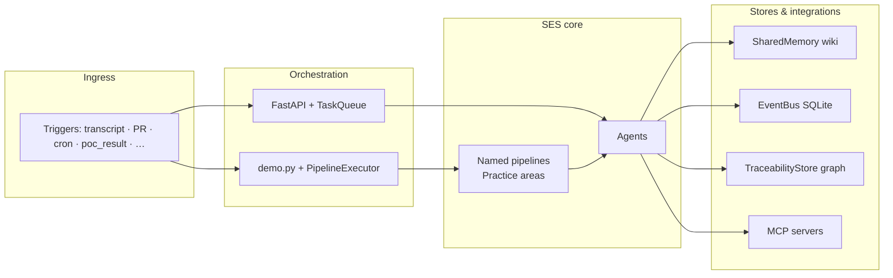
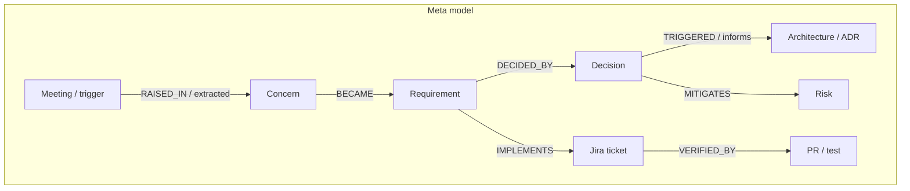

# eParts SES — Software Engineering System Architecture

This note is for presenters and integrators who need a **plug-and-play mental model**: what fires the system, what runs inside, how pieces connect across practice areas, and the **meta model** for artifacts and knowledge.

SES is intentionally a **framework** (agents + pipelines + shared state + events), not a set of unrelated scripts.

---

## 1. Big picture — three layers

| Layer | Role |
|-------|------|
| **Triggers** | External inputs: transcripts, Git PRs, Jira hooks, POC results, crons. Each has a **`trigger_type`** string. |
| **Orchestration** | **FastAPI** (`orchestrator/main.py`): `/webhook` and `/trigger` enqueue work on a **TaskQueue**; agents run asynchronously. **`demo.py`** uses **`PipelineExecutor`** directly to run a **whole pipeline** synchronously—best for scripted demos. |
| **Agents + pipelines** | **Pipelines** are ordered **`PipelineStep`** chains (**`pipeline/pipelines.py`**). Each step invokes one **registered agent**. Data flows via **`PipelineContext`**: upstream outputs merge into keyed context fields for downstream steps. |
| **Side-effect buses** | **Shared Memory** (“wiki”: namespaced KV), **Event Bus** (pub/sub audit + subscriptions), **Traceability Store** (artifact graph). Agents also call **MCP clients** (Jira, GitHub, Confluence, etc.) via `agents/base.BaseAgent`. |



**Plug-and-play idea:** Swap or add an **agent** in **`orchestrator/registry.py`**, register it by name; wire it into a **pipeline step** or a **trigger route**. Connect cross-practice workflows by **`emit(...)`** on **`BaseAgent`** and **EventBus** subscriptions (see §4).

---

## 2. Pipelines vs triggers (“which pipeline fires when?”)

Pipelines are defined in **`pipeline/pipelines.py`** as **`Pipeline`** objects. Each declares **`trigger_types`**—the contract for which **incoming trigger categories** could start that logical flow. The router **`orchestrator/router.py`** maps **`trigger_type`** to **agent lists** for the API path; **`TRIGGER_PIPELINES`** is built programmatically from those same **`Pipeline`** definitions.

**Canonical catalogue (7 pipelines)**

| Pipeline `name` | Practice area | `trigger_types` | Purpose (compact) |
|-----------------|---------------|-----------------|-------------------|
| `requirements` | Requirements Engineering | `transcript` | VTT/text → parse → classify → REQ files → Jira → minutes → decisions → drift check |
| `coach_session` | Coach Session Memory | `coach_transcript` | Parse → embed session → concerns → linker → decisions |
| `architecture` | Architecture | `transcript`, `pr_event` | Full drift vs canon → ADR → diagram PR → traceability matrix |
| `coding` | Coding | `pr_event` | PR review → tests → docs → prompt regression |
| `ml_decision` | ML Decision Memory | `poc_result` | Evidence → readiness → coach links |
| `project_mgmt` | Project Management | `cron_friday_6pm` | WBS sync → digest → alerts |
| `knowledge` | Knowledge Management | `cron_pre_meeting` | Context pack → briefing |

**Representative sequence (requirements)** — each row is one **`PipelineStep`**; context keys **`input_keys`/`output_key`** thread data (`parsed_minutes` → `classified_items` → `requirements`, etc.):

1. `transcript_parser`  
2. `priority_classifier`  
3. `req_extractor`  
4. `ticket_creator`  
5. `minutes_publisher`  
6. `decision_logger`  
7. `drift_detector`  

Conditional steps use **`skip_if_empty`**: if a context key is empty, the step is skipped without failing the run.

Inside a run:

1. Build **`PipelineContext`** from **`trigger_payload`** (`trigger_type`, `source`, merged data).
2. For each step: resolve **`AgentTrigger`**, run **`agent.execute`**, **`_deposit_to_wiki`** (when applicable), merge **`AgentResult.data`** and outputs into **`ctx.data`**.
3. Return **`PipelineResult`** (metrics, artifacts, human-review flags).

Reference: **`PipelineExecutor`** docstring and **`PipelineContext`**, **`Pipeline`** in **`pipeline/pipelines.py`**.

---

## 3. APIs and two ways to execute work

### 3.1 FastAPI orchestrator (async, queue-backed)

- **`POST /webhook`** — body includes **`trigger_type`**, **`source`**, **`metadata`**; resolves agents via **`resolve_agents()`** (**`orchestrator/router.py`**: **`TRIGGER_ROUTES`**).
- **`POST /trigger`** — run a named agent with a payload (**manual override**).
- **`GET /agents`** — registered agents plus **`TRIGGER_ROUTES`** for observability.

This path is geared toward **routing and fan-out**, not necessarily one full **`Pipeline`** object per HTTP call—it depends how tasks are wired in **`TaskQueue`** and registry.

### 3.2 Direct pipeline executor (demo / batch)

Scripts such as **`demo.py`** instantiate **`PipelineExecutor(agents)`** and call **`execute(REQUIREMENTS_PIPELINE, {trigger_type: "transcript", source: path})`**.

That guarantees **exactly one pipeline DAG** runs end-to-end with **ordering and skip rules** as defined in code.

---

## 4. Event bus — what events exist and what they unlock

Agents call **`emit(event_type, data, pipeline=...)`** on **`BaseAgent`**. **`EventBus.publish`** persists to SQLite (**`memory/events.db`**) and returns **matching subscriptions**.

### 4.1 Well-known **`EVENT_TYPES`** (contract)

Declared in **`pipeline/event_bus.py`** (readable labels). Examples:

- **`drift_detected`** — requirement discussion contradicts canon architecture  
- **`new_requirements`** — requirements extracted  
- **`action_items_extracted`** — action items surfaced  
- **`decision_logged`** — captured decision  
- **`recurring_concern`**, **`commitment_overdue`**, **`new_session_embedded`** — coach/mentor lineage  
- **`decision_ready`**, **`poc_evidence_logged`** — ML decision flow  
- **`human_review_needed`**, **`artifact_produced`** — governance / outputs  

These names are the **interop contract** between teams and pipelines—treat them as API surface area.

### 4.2 Default subscriptions (routing table snapshot)

Inserted in **`EventBus._setup_default_subscriptions()`** unless already present—a **subscriber** row means “when **`event_type`** fires, logically notify **`target_pipeline`** (+ optional **`target_agent`**).” Illustrative mappings:

| Event | Typical downstream (from defaults) |
|-------|--------------------------------------|
| `drift_detected` | **`architecture`** — deeper architecture review loop |
| `new_requirements` | **`architecture`**, agent **`drift_detector`** subscription row |
| `action_items_extracted` | **`project_mgmt`**, **`ticket_creator`** — align ticketing |
| `recurring_concern` / `commitment_overdue` | **`project_mgmt`**, **`alert_agent`** |
| `new_session_embedded` | **`knowledge`**, **`briefing_generator`** |
| `decision_logged` | **`knowledge`**, **`decision_logger`** |
| `human_review_needed` | **`project_mgmt`**, **`alert_agent`** |
| … | *(see DB table `subscriptions` for full wiring)* |

**Runtime note:** In-process **`subscribe_handler`** callbacks run synchronously for demos; production could attach a queue consumer.

---

## 5. Meta model — artifacts, wiki, traceability

SES encodes CMU-studio traceability explicitly in two complementary stores plus events.

### 5.1 **Shared Memory** (**“wiki pattern”**) — **`pipeline/shared_memory.py`**

- **SQLite** KV with **namespaces** (e.g. `requirements`, `architecture`, `decisions`, `risks`, `meetings`, `ml_decisions`, …).
- Each write records **agent + pipeline**, enabling “who enriched the wiki?”
- Enables **agents to read cumulative project context** rather than isolated outputs.

### 5.2 **Traceability Store** — **`pipeline/traceability.py`**

- **Artifacts**: typed nodes (`concern`, `requirement`, `decision`, `risk`, **jira_ticket**, **pull_request**, `test`, **`adr`**, **`meeting`**, **`coach_session`**, …).
- **Links**: directed typed edges (**`BECAME`**, **`IMPLEMENTS`**, **`MITIGATES`**, **`RAISED_IN`**, **`DECIDED_BY`**, **`TRIGGERED`**, **`VERIFIED_BY`**, **`SUPERSEDES`**, **`DEPENDS_ON`**, …).

This is the graph answer to:

> Trace from *client sentence* → REQ → architecture → Jira → PR → test → risk closed.

The **meta model** for architecture talks is:

**Artifact (typed) —(typed link)→ Artifact**, plus **status** and **provenance**; parallel **wiki** entries for narrative and fast agent lookup.

### 5.3 **ETVX / process IDs**

Each **`PipelineStep`** can carry **`etvx_id`** (e.g. **REQ-PARSE**, **ARCH-DRIFT**) to align pipeline steps with process documentation and dashboards.

### 5.4 **Meta-model diagram (conceptual)**



---

## 6. MCP (Model Context Protocol) — external systems

Agents receive **`mcp_clients`** (Jira, GitHub, Confluence, etc.). **When credentials are missing**, agents **degrade gracefully** (log + offline behaviour), consistent with demos.

---

## 7. How to extend (checklist)

1. **New agent**: Implement **`BaseAgent`**, **`run(trigger) -> AgentResult`**, register in **`orchestrator/registry.py`**.
2. **New pipeline or step**: Add **`Pipeline`** / **`PipelineStep`** in **`pipeline/pipelines.py`**, extend **`trigger_types`** and **`TRIGGER_PIPELINES`**.
3. **New trigger from outside**: Extend **`WebhookPayload`** descriptions and **`TRIGGER_ROUTES`** in **`router.py`**; ensure **`execute`** payloads match **`input_keys`**.
4. **New cross-cutting reaction**: **`emit`** a new **`event_type`** (add to **`EVENT_TYPES`**) or reuse an existing one; insert a **subscription** row strategy (code or DB bootstrap).
5. **Traceability**: On new outward artifacts, **`TraceabilityStore`** updates from agents like **`traceability_builder`**; keep **`ARTIFACT_TYPES` / LINK_TYPES`** in mind.

---

## 8. References in repo

| File | Contents |
|------|----------|
| `pipeline/pipelines.py` | **`ALL_PIPELINES`**, **`PipelineExecutor`**, **`TRIGGER_PIPELINES`**, **`get_framework_summary()`** |
| `pipeline/event_bus.py` | **`EVENT_TYPES`**, **`EventBus`**, default **subscriptions** |
| `pipeline/shared_memory.py` | Wiki namespaces |
| `pipeline/traceability.py` | Artifact/link meta model |
| `orchestrator/main.py`, `orchestrator/router.py` | HTTP API, **`TRIGGER_ROUTES`** |
| `agents/base.py` | **`AgentTrigger`**, **`emit`**, MCP hooks |

Programmatic introspection for slides:

```python
from pipeline.pipelines import get_framework_summary
import json
print(json.dumps(get_framework_summary(), indent=2))
```

---

*Synthetic scenario content (e.g. demo transcripts) is for education—see disclaimers beside bundled examples.*
